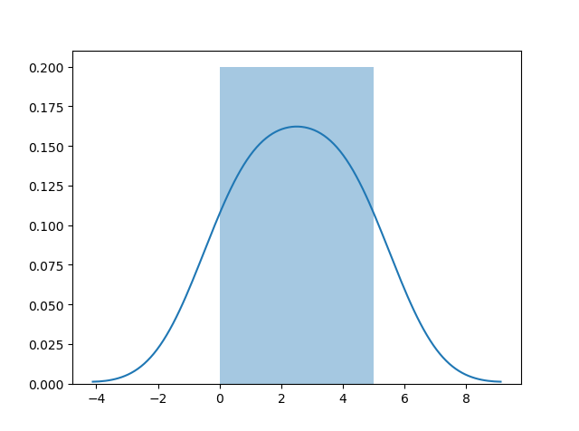

# Read : 14

## Data Visualization

### Matplotlib

- Matplotlib is a plotting library for the Python programming language and its numerical mathematics extension NumPy.

- Pyplot is a Matplotlib module which provides a MATLAB-like interface. 
- Matplotlib is designed to be as usable as MATLAB, with the ability to use Python, and the advantage of being free and open-source. 

- **Seaborn**: provides an API on top of Matplotlib that offers sane choices for plot style and color defaults, defines simple high-level functions for common statistical plot types, and integrates with the functionality provided by Pandas.

- **Import Seaborn:**
```
import seaborn as sns 
```

- **Plotting a Displot**: Distplot stands for distribution plot, it takes as input an array and plots a curve corresponding to the distribution of points in the array. 
```
import matplotlib.pyplot as plt
import seaborn as sns
sns.distplot([0, 1, 2, 3, 4, 5])
plt.show() 
```

- **Plotting a Distplot Without the Histogram:**
```
sns.distplot([0, 1, 2, 3, 4, 5], hist=False)
```



##### [Go Back](code_401_reading_notes.md)